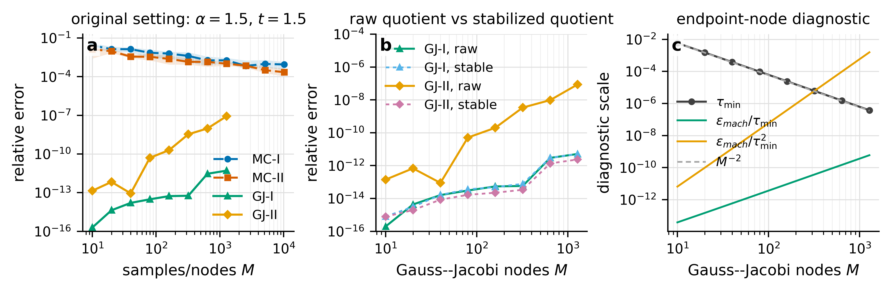
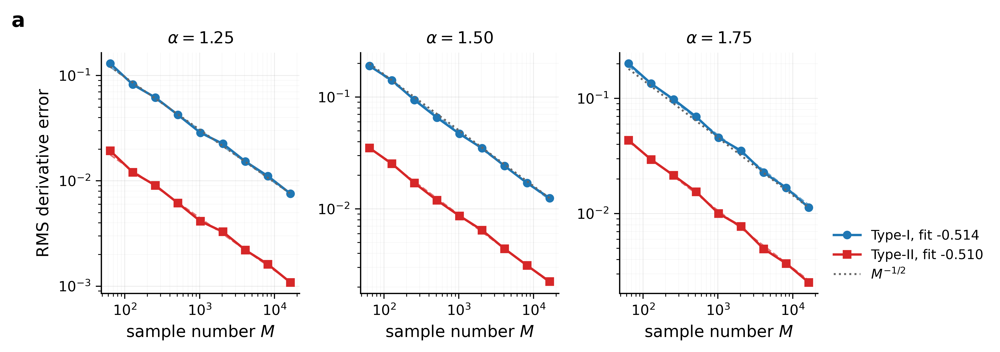
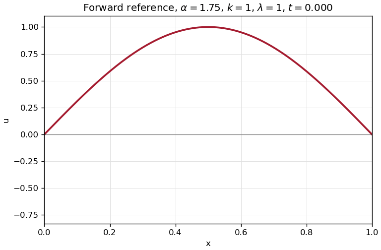
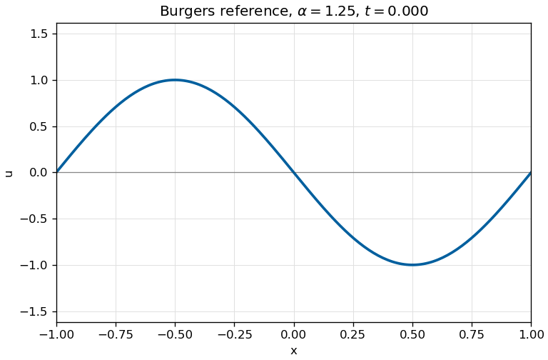
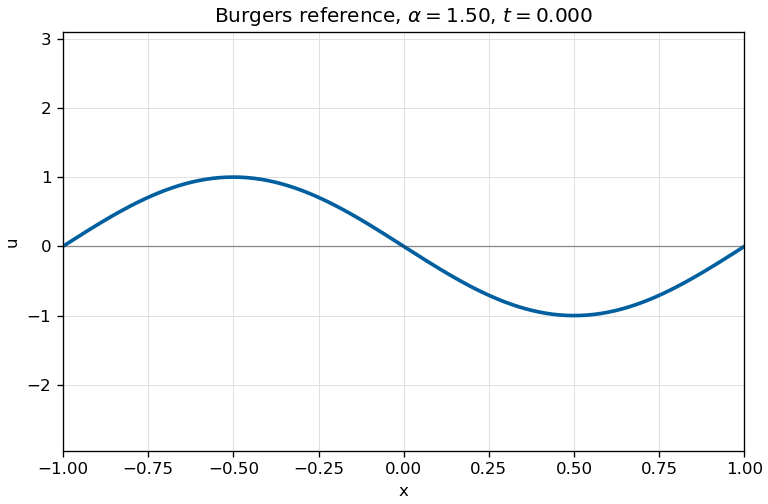
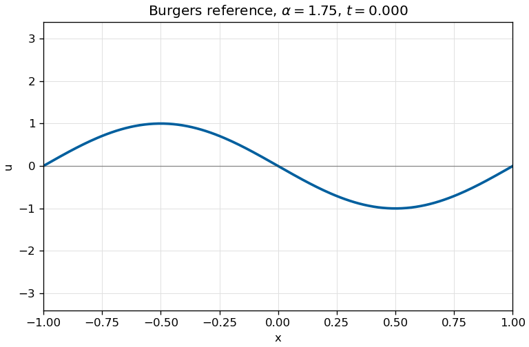

# tDWfPINNs

[](./LICENSE)
[](https://www.python.org/downloads/)
[](https://github.com/jax-ml/jax)

This repository contains the code and generated artifacts for transformed
diffusion-wave fractional PINNs. The paper focuses on Caputo orders
`alpha in (1, 2)`, proves transformed Type-I and Type-II fractional-derivative
representations, validates the quadrature behavior at derivative level, and
implements the current benchmark cases in JAX.

The maintained training implementation is JAX. Numerical reference solvers use
NumPy/SciPy and are kept only for data generation and validation.

## Install

Use a normal Python environment and install the project requirements:

```bash
python -m venv .venv
.venv\Scripts\activate
python -m pip install --upgrade pip
python -m pip install -r requirements.txt
```

On Linux or macOS, activate the virtual environment with:

```bash
source .venv/bin/activate
```

The current local environment used for this repository is Python `3.13.2` with
JAX `0.8.1`. The `requirements.txt` file installs the standard JAX/JAXLIB wheel;
for full-scale GPU training, install the accelerator-specific JAX build that
matches the target machine before running the large models.

Check the installation with:

```bash
python -c "import jax; print(jax.__version__); print(jax.devices())"
```

## Repository Layout

| Path | Description |
| --- | --- |
| [`conf/`](conf/) | Hydra configs for model, optimizer, training, W&B, saving, and PDE cases. |
| [`libs/`](libs/) | Shared JAX PINN, PDE, sampler, evaluator, checkpoint, and timing utilities. |
| [`jax_forward.py`](jax_forward.py) | JAX Section 4.3 one-dimensional forward benchmark. |
| [`jax_burgers.py`](jax_burgers.py) | JAX one-dimensional fractional Burgers benchmark. |
| [`jax_irregular.py`](jax_irregular.py) | JAX two-dimensional circular-hole and L-shaped irregular-domain cases. |
| [`reference_solvers/`](reference_solvers/README.md) | PDE-specific reference solution and GIF generators. |
| [`theoretical_analysis/`](theoretical_analysis/README.md) | Derivative-level validation code and paper-ready theory figures. |
| [`scripts/`](scripts/) | Smoke plotting and visualization utilities. |
| [`data/`](data/) | Stored reference arrays and generated GIFs. |
| [`tests/`](tests/) | Focused JAX and reference-generation tests. |

## Theory Validation

The theory validation scripts are derivative-level experiments. They do not
train PINNs; they isolate the numerical behavior of the transformed Caputo
estimators used by the paper. See
[`theoretical_analysis/README.md`](theoretical_analysis/README.md) for the
package map and
[`theoretical_analysis/MCfd_integrated_final_package/README.md`](theoretical_analysis/MCfd_integrated_final_package/README.md)
for exact regeneration commands.

| Paper part | Numerical check | Main artifact |
| --- | --- | --- |
| Theorem `thm:represent_2`, direct and transformed representations | Type-I and Type-II both evaluate the same Caputo derivative while Type-II avoids shifted derivative calls. | `MCfd_integrated_final_package/code/MCfd_refactored_validation.py` |
| Theorem `thm:stability`, representation-level stability | Type-I and Type-II have the same `C^2`-seminorm stability constant in exact arithmetic. | alpha and M diagnostics in `figures/alpha/` and `figures/M_effect/` |
| Corollary `coro:4`, Type-I and Type-II numerical schemes | MC-I, MC-II, GJ-I, and GJ-II are compared on the same scalar derivative benchmarks. | `fig01_alpha_sweep_exp.png`, `fig02_M_sweep_exp_diagnostic.png` |
| Proposition `prop:mc-convergence` | Monte Carlo root-mean-square derivative error follows `O(M^-1/2)`. | `figures/rate/fig09_mc_sqrtM_rate.png` |
| Propositions `prop:delta-conditioning` and `prop:regularization-bias` plus Remark `rem:delta-tradeoff` | Denominator cutoff balances `delta^(2-alpha)` bias against `delta^(1-alpha)` and `delta^(-alpha)` endpoint amplification. | `figures/tradeoff/fig06_remark31_multialpha_delta_tradeoff_rates.png` |
| Theorem `thm:GJ-convergence` | Gauss-Jacobi quadrature gives algebraic `O(M^-r)` rates for finitely smooth kernels and spectral `O(rho^(-2M))` rates for analytic kernels. | `figures/rate/fig10_gj_rho_spectral_rate.png`, `gj_mr_rate_validation/` |
| Proposition `prop:complexity` | Type-II removes the `O(NM)` shifted automatic-differentiation calls required by Type-I. | timing and memory discussion in the paper experiments |
| Finite-precision remark near `alpha -> 2` | Raw endpoint quotients can deteriorate because the smallest GJ nodes approach `tau=0`; stable quotient evaluation removes this implementation artifact. | `alpha2_precision_remark/figures/fig12_alpha2_gj_precision_sweep.png` |

Representative figures:







## Benchmark Cases

| Case | Entry point | Reference |
| --- | --- | --- |
| Section 4.3 forward | `python jax_forward.py pde=forward` | Analytic Mittag-Leffler solution. |
| Fractional Burgers | `python jax_burgers.py pde=burgers` | Stored numerical arrays in `data/burgers_*.npz`. |
| Circular-hole irregular domain | `python jax_irregular.py pde=irregular_hole` | Masked finite-difference reference plus manufactured exact solution. |
| L-shaped domain | `python jax_irregular.py pde=lshape` | Backward-Euler convolution-quadrature reference on the L-shaped grid. |

### 1D Forward Problem

The Section 4.3 forward benchmark solves

```text
{}^C D_t^alpha u - lambda / (k^2 pi^2) u_xx = 0,
    (t, x) in (0, 2] x (0, 1)
u(t, 0) = u(t, 1) = 0
u(0, x) = a sin(k pi x)
u_t(0, x) = b sin(k pi x)
```

with analytic solution

```text
u(t, x) = sin(k pi x)
          [a E_{alpha,1}(-lambda t^alpha)
           + b t E_{alpha,2}(-lambda t^alpha)].
```

The paper Section 4.3 setting is `alpha=1.75`, `lambda=1`, `k=1`, `a=1`,
and `b=-0.5`.



### 1D Burgers Problem

The Burgers benchmark solves

```text
{}^C D_t^alpha u + u u_x - (0.01 / pi) u_xx = 0,
    (t, x) in (0, 1.2] x (-1, 1)
u(t, -1) = u(t, 1) = 0
u(0, x) = -sin(pi x)
u_t(0, x) = beta sin(pi x)
```

The stored reference arrays use zero initial velocity, `beta=0.0`. Keep
`pde.beta` consistent when training directly against `data/burgers_*.npz`.







### 2D Irregular Problems

Two-dimensional reference generation is documented in
[`reference_solvers/irregular_hole_2d/README.md`](reference_solvers/irregular_hole_2d/README.md)
and [`reference_solvers/lshape_2d/README.md`](reference_solvers/lshape_2d/README.md).

The circular-hole case uses

```text
Omega = (-1, 1)^2 \ B_0.25((-0.3, 0.2))

{}^C D_t^alpha u - div(a(x, y) grad u)
    + b(x, y) . grad u + lambda u^3 = f(t, x, y)

alpha = 1.5
a(x, y) = 1 + 0.3 sin(pi x) cos(pi y)
b(x, y) = (1 + y, x - 1)
lambda = 1
```

The L-shaped case uses

```text
Omega_L = [-1, 1]^2 \ [0, 1]^2

{}^C D_t^1.8 u - 0.25 Delta u = 0,
    (t, x, y) in (0, 1] x Omega_L

u = 0 on partial Omega_L
u(0, x, y) = g(x, y)
u_t(0, x, y) = 0.2 g(x, y)
```

The training configuration and default reference archive use `T = 1`. The
README preview below is generated with `T = 5` only to make the time evolution
easier to inspect.


## Reference Solutions

Reference GIF generators live next to the PDE-specific solver code:

```bash
python reference_solvers/forward_1d/generate_forward_reference_gif.py
python reference_solvers/burgers_1d/generate_burgers_reference_gifs.py
python reference_solvers/irregular_hole_2d/generate_irregular_hole_reference.py
python reference_solvers/lshape_2d/generate_lshape_reference.py
python reference_solvers/lshape_2d/generate_lshape_reference.py --t-final 5.0 --output-prefix lshape_reference_T5 --gif-only
```

Outputs are written to:

| Generator | Output |
| --- | --- |
| `forward_1d/generate_forward_reference_gif.py` | `data/reference_1d/forward_alpha1p75_reference.gif` |
| `burgers_1d/generate_burgers_reference_gifs.py` | `data/reference_1d/burgers_alpha*_reference.gif` and `burgers_reference_summary.csv` |
| `irregular_hole_2d/generate_irregular_hole_reference.py` | `data/irregular_hole/irregular_hole_reference.npz`, `irregular_hole_reference.gif`, `irregular_hole_exact.gif` |
| `lshape_2d/generate_lshape_reference.py` | `data/lshape/lshape_reference.npz`, `lshape_reference.gif`; README preview `lshape_reference_T5.gif` |

Detailed options are in [`reference_solvers/README.md`](reference_solvers/README.md).

## Training

For a CPU smoke run, keep the batch, quadrature, and step counts small and turn
W&B off:

```bash
python jax_forward.py pde=forward wandb.mode=disabled training.max_steps=2 training.batch.in=4 training.batch.bd=2 training.batch.init=2 pde.GJ.nums=3 weighting.scheme=none
python jax_burgers.py pde=burgers wandb.mode=disabled training.max_steps=2 training.batch.in=4 training.batch.bd=2 training.batch.init=2 pde.GJ.nums=3 weighting.scheme=none
python jax_irregular.py pde=irregular_hole wandb.mode=disabled training.max_steps=2 training.batch.in=8 training.batch.bd=4 training.batch.init=4 pde.GJ.nums=3 weighting.scheme=none
python jax_irregular.py pde=lshape wandb.mode=disabled training.max_steps=2 training.batch.in=8 training.batch.bd=4 training.batch.init=4 pde.GJ.nums=3 weighting.scheme=none
```

For normal training, use the same entry points without the smoke overrides:

```bash
python jax_forward.py pde=forward wandb.mode=online
python jax_burgers.py pde=burgers wandb.mode=online
python jax_irregular.py pde=irregular_hole wandb.mode=online
python jax_irregular.py pde=lshape wandb.mode=online
```

Common overrides:

```bash
python jax_forward.py pde=forward training.max_steps=50000 pde.GJ.nums=80 wandb.mode=online
python jax_irregular.py pde=lshape training.max_steps=50000 training.batch.in=20000 pde.GJ.nums=64 wandb.mode=online
```

Each training run is saved under a timestamped Hydra directory:

```text
outputs/<pde.name>/<YYYY-MM-DD_HH-MM-SS>/
```

The run directory contains `.hydra/`, `timing.csv`, and `checkpoints/`. Periodic
checkpoints are saved every `saving.save_every_steps`; final checkpoints use
the `final` prefix.

## Weights & Biases

Log in once:

```bash
wandb login
```

Then run with online logging:

```bash
python jax_forward.py pde=forward wandb.mode=online wandb.project=tDWfPINN wandb.entity=<your-entity>
```

Use `wandb.mode=disabled` for local smoke tests or offline machines. The
default W&B settings are in [`conf/config.yaml`](conf/config.yaml).

## Smoke Figures

Smoke figures are generated by short CPU runs and plotted as independent
`true`, `sol`, and `abs_error` panels. Two-dimensional cases are plotted as
paper-style `x-y` heatmaps at representative time slices.

```bash
python scripts/generate_smoke_results.py --case burgers
python scripts/generate_smoke_results.py --case forward
python scripts/generate_smoke_results.py --case irregular_hole
python scripts/generate_smoke_results.py --case lshape
```

The summary is written to:

```text
outputs/smoke_results/summary.csv
```

## Timing

Training scripts record paper-style timing by default. One timing epoch is
`5000` optimizer steps, matching the paper's convention that one reported epoch
contains 5000 Adam updates.

The timing CSV is written to the current run directory as `timing.csv`:

```text
epoch, step, epoch_steps, elapsed_seconds, total_seconds, average_epoch_seconds, loss
```

Configure timing in [`conf/training/default.yaml`](conf/training/default.yaml):

```yaml
training:
  timing:
    enabled: true
    epoch_steps: 5000
    filename: timing.csv
```

## Tests

Run the focused JAX tests:

```bash
pytest -q tests/test_jax_forward.py tests/test_jax_irregular.py tests/test_jax_pde.py tests/test_sampler.py
```

Run generation-related tests:

```bash
pytest -q tests/test_reference_gif_generators.py tests/test_lshape_reference.py tests/test_smoke_plot_outputs.py
```
