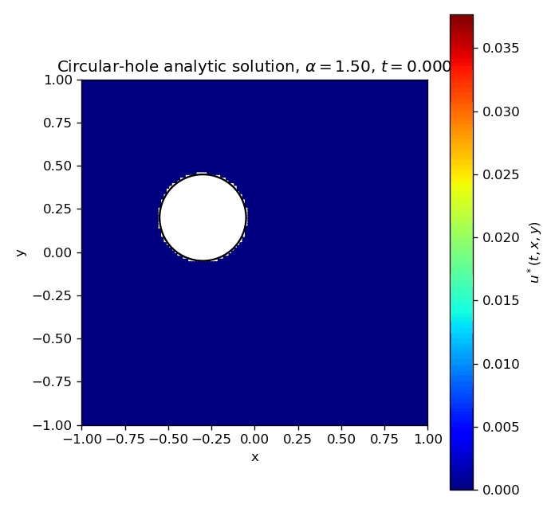
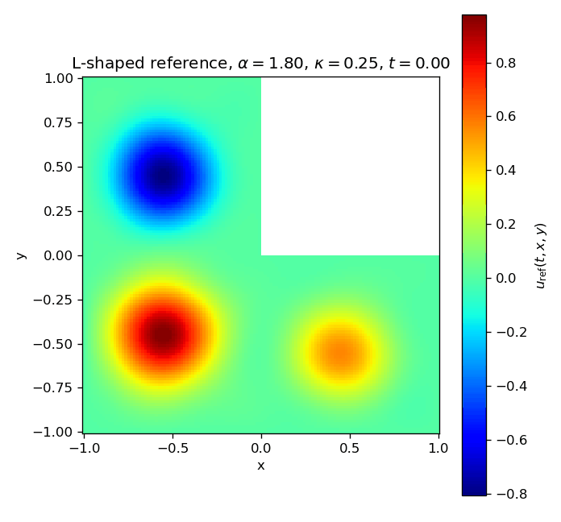

# tDWfPINN PyTorch

[](./LICENSE)
[](https://www.python.org/downloads/)
[](https://pytorch.org/)

This branch contains the PyTorch implementation of transformed
diffusion-wave fractional PINNs for Caputo orders `alpha in (1, 2)`. The
training code supports the transformed Type-I and Type-II formulas with either
Monte Carlo or Gauss-Jacobi quadrature:

| Method | Formula type | Quadrature |
| --- | --- | --- |
| `MC-I` | Type-I | Monte Carlo |
| `MC-II` | Type-II | Monte Carlo |
| `GJ-I` | Type-I | Gauss-Jacobi |
| `GJ-II` | Type-II | Gauss-Jacobi |

The current PyTorch branch includes the one-dimensional forward benchmark plus
two registered two-dimensional irregular-domain cases:

| Case | Config | PDE class | Reference used for plots |
| --- | --- | --- | --- |
| 1D forward | `pde=dw_forward` | `src.physics.dw_pde.DWForward` | Analytic Mittag-Leffler solution |
| 2D circular hole | `pde=irregular_hole` | `src.physics.irregular_2d.IrregularHole2D` | Manufactured analytic solution |
| 2D L-shape | `pde=lshape` | `src.physics.irregular_2d.LShape2D` | `data/lshape/lshape_reference.npz` |

## Paper Context

For `alpha in (1, 2)`, the Caputo diffusion-wave operator is evaluated through
transformed representations rather than by differentiating the network twice in
time under a singular convolution kernel. In this branch:

| Paper ingredient | PyTorch implementation |
| --- | --- |
| Transformed Type-I representation | `_gj_i` and `_mc_i` in `src.physics.pde.TimeFracCaputoDiffusionWaveTwoDimPDE` and `src.physics.irregular_2d.Irregular2DBase` |
| Transformed Type-II representation | `_gj_ii` and `_mc_ii` in the same PDE bases |
| Gauss-Jacobi quadrature for the endpoint singular kernel | `src.physics.fractional.roots_jacobi` and `pde.gj_params.nums` |
| Monte Carlo quadrature for the same transformed integrals | `pde.monte_carlo_params.nums` and `pde.monte_carlo_params.eps` |
| Type-I/Type-II timing comparison | `timing.csv` with one row per `trainer.timing.epoch_steps` optimizer steps |

The practical distinction is that Type-I evaluates shifted time derivatives,
whereas Type-II evaluates shifted network values. The timing scripts expose
both choices for MC and GJ so the cost can be compared with the same model,
batch sizes, and quadrature counts.

## Install

Use a normal Python environment and install the requirements:

```bash
python -m venv .venv
source .venv/bin/activate
python -m pip install --upgrade pip
python -m pip install -r requirements.txt
```

On Windows PowerShell, activate the environment with:

```powershell
.\.venv\Scripts\Activate.ps1
```

The local smoke tests were run with Python `3.13.2` and PyTorch `2.10.0`.
For GPU training, install the PyTorch build that matches the server CUDA stack
before installing the remaining requirements.

Check the installation with:

```bash
python -c "import torch; print(torch.__version__); print(torch.cuda.is_available())"
```

## Repository Layout

| Path | Description |
| --- | --- |
| [`conf/`](conf/) | Hydra configuration for model, optimizer, trainer, plotter, and PDE cases. |
| [`src/train.py`](src/train.py) | Main PyTorch training entry point. |
| [`src/models/`](src/models/) | MLP network used by the PINN. |
| [`src/physics/`](src/physics/) | Fractional operators and PDE residual definitions. |
| [`src/data/`](src/data/) | 1D, circular-hole, and L-shaped domain samplers. |
| [`src/vis/`](src/vis/) | Matplotlib/Plotly plotting helpers and raw `.npz` export. |
| [`data/`](data/) | Stored 1D Burgers arrays and 2D irregular-domain reference data. |
| [`scripts/`](scripts/) | Shell launchers for full, debug, and 2D method timing runs. |
| [`tests/`](tests/) | Unit tests for config loading, fractional operators, and registered 2D cases. |

## PDE Cases

### 1D Forward Problem

The forward benchmark solves

```text
{}^C D_t^alpha u - lambda / (k^2 pi^2) u_xx = 0,
    (t, x) in (0, 2] x (0, 1),

u(t, 0) = u(t, 1) = 0,
u(0, x) = a sin(k pi x),
u_t(0, x) = b sin(k pi x).
```

The analytic solution used for evaluation is

```text
u(t, x) = sin(k pi x)
          [a E_{alpha,1}(-lambda t^alpha)
           + b t E_{alpha,2}(-lambda t^alpha)].
```

The default config is `alpha=1.75`, `k=2`, `lambda=1`, `a=1`, and `b=1`.

### 2D Circular-Hole Case

The circular-hole benchmark uses

```text
Omega = (-1, 1)^2 \ B_0.25((-0.3, 0.2)),

{}^C D_t^alpha u - div(a(x, y) grad u)
    + b(x, y) . grad u + lambda u^3 = f(t, x, y),

alpha = 1.5,
a(x, y) = 1 + 0.3 sin(pi x) cos(pi y),
b(x, y) = (1 + y, x - 1),
lambda = 1.
```

The manufactured exact solution is

```text
u(t, x, y) = q(t) phi(x, y),
q(t) = t^2 (1 - t)^2,
phi(x, y) = (1 - x^2)(1 - y^2)
            ((x + 0.3)^2 + (y - 0.2)^2 - 0.25^2).
```

Preview reference data:



### 2D L-Shaped Case

The L-shaped benchmark uses

```text
Omega_L = [-1, 1]^2 \ [0, 1]^2,

{}^C D_t^1.8 u - 0.25 Delta u = 0,
    (t, x, y) in (0, 1] x Omega_L,

u = 0 on partial Omega_L,
u(0, x, y) = g(x, y),
u_t(0, x, y) = 0.2 g(x, y).
```

The initial profile is the three-bump profile implemented in
[`src/physics/irregular_2d.py`](src/physics/irregular_2d.py). Training uses
`data/lshape/lshape_reference.npz` for plotting the reference solution at
`t=T/2` and `t=T`. The README preview below uses the longer `T=5` GIF only to
make the wave-like evolution easier to inspect.



## Training

Run the default one-dimensional forward case:

```bash
python src/train.py
```

Run a short CPU smoke test:

```bash
python src/train.py pde=dw_forward plot=matplotlib wandb.mode=disabled trainer.max_steps=10 trainer.timing.epoch_steps=5 trainer.batch_size.domain=8 trainer.batch_size.boundary=4 trainer.batch_size.initial=4 trainer.rad.use=false pde.gj_params.nums=8 pde.gauss_jacobi_params.nums=8 model.hidden_dim=16 model.num_layers=2
```

Run the two-dimensional cases:

```bash
python src/train.py pde=irregular_hole plot=matplotlib wandb.mode=disabled
python src/train.py pde=lshape plot=matplotlib wandb.mode=disabled
```

For a tiny smoke run that quickly proves the image and timing pipeline:

```bash
python src/train.py pde=irregular_hole plot=matplotlib wandb.mode=disabled trainer.max_steps=1 trainer.timing.epoch_steps=1 trainer.batch_size.domain=4 trainer.batch_size.boundary=2 trainer.batch_size.initial=2 trainer.rad.use=false pde.gj_params.nums=3 pde.gauss_jacobi_params.nums=3 pde.monte_carlo_params.nums=3 model.hidden_dim=8 model.num_layers=1 pde.plot_grid=24
python src/train.py pde=lshape plot=matplotlib wandb.mode=disabled trainer.max_steps=1 trainer.timing.epoch_steps=1 trainer.batch_size.domain=4 trainer.batch_size.boundary=2 trainer.batch_size.initial=2 trainer.rad.use=false pde.gj_params.nums=3 pde.gauss_jacobi_params.nums=3 pde.monte_carlo_params.nums=3 model.hidden_dim=8 model.num_layers=1
```

Enable the Adam + L-BFGS hybrid schedule with `optimizer.lbfgs.use=true`:

```bash
python src/train.py pde=irregular_hole plot=matplotlib wandb.mode=disabled optimizer.lbfgs.use=true trainer.max_steps=10000 trainer.steps_per_epoch=5000 optimizer.lbfgs.max_iter=10 optimizer.lbfgs.lr=0.01 trainer.rad.use=true
python src/train.py pde=lshape plot=matplotlib wandb.mode=disabled optimizer.lbfgs.use=true trainer.max_steps=10000 trainer.steps_per_epoch=5000 optimizer.lbfgs.max_iter=10 optimizer.lbfgs.lr=0.01 trainer.rad.use=true
```

For this path, `epochs = trainer.max_steps // trainer.steps_per_epoch`. Each
epoch samples one batch, applies RAD when enabled, runs Adam for
`trainer.steps_per_epoch` updates on that batch, then runs one PyTorch L-BFGS
phase using `optimizer.lbfgs.max_iter`. Timing records only the Adam phase, and
both Adam and L-BFGS losses are logged.

## 2D Method Timing Runs

Use the server script to run both irregular-domain cases across Type-I,
Type-II, MC, and GJ variants:

```bash
STEPS=5000 GJ_QUAD=64 MC_QUAD=640 bash scripts/run_pytorch_2d_cases.sh all GJ-I,GJ-II,MC-I,MC-II
```

Run only L-shape with Gauss-Jacobi Type-II:

```bash
STEPS=5000 GJ_QUAD=64 bash scripts/run_pytorch_2d_cases.sh lshape GJ-II
```

Important script parameters:

| Variable | Meaning | Default |
| --- | --- | --- |
| `STEPS` | Adam update steps | `5000` |
| `STEPS_PER_EPOCH` | Adam updates per hybrid epoch | `5000` |
| `USE_LBFGS` | Enable hybrid Adam + L-BFGS | `0` |
| `LBFGS_MAX_ITER` | L-BFGS iterations per hybrid epoch | `10` |
| `TIMING_EPOCH_STEPS` | Steps per timing row | `5000` |
| `DOMAIN_BATCH` | Interior collocation batch size | `64` |
| `BOUNDARY_BATCH` | Boundary batch size | `16` |
| `INITIAL_BATCH` | Initial-condition batch size | `16` |
| `GJ_QUAD` | Gauss-Jacobi nodes | `64` |
| `MC_QUAD` | Monte Carlo samples | `640` |
| `HIDDEN_DIM` | MLP hidden width | `64` |
| `NUM_LAYERS` | MLP hidden layers | `4` |
| `WANDB_MODE` | W&B mode | `disabled` |

## Outputs

Hydra creates one timestamped run directory per command. Normal direct runs use

```text
outputs/YYYY-MM-DD/HH-MM-SS/
```

The 2D timing script uses

```text
outputs/pytorch_2d/<case>/<method>/<YYYY-MM-DD_HH-MM-SS>/
```

Each run directory contains:

| Output | Description |
| --- | --- |
| `.hydra/` | Resolved Hydra config for the run. |
| `checkpoint_<step>.pt` | Model checkpoint saved at evaluation steps. |
| `timing.csv` | Paper-style timing rows. |
| `results/plots/*.jpg` | Independent `true`, `sol`, and `abs_error` figures. |
| `results/raw_data/*.npz` | Raw arrays used by each plotted panel. |

The timing file has this schema:

```text
epoch,step,epoch_steps,elapsed_seconds,total_seconds,average_epoch_seconds,loss,adam_loss,lbfgs_loss
```

By default, one timing epoch is `5000` Adam steps, matching the paper's timing
convention. For smoke tests, override `trainer.timing.epoch_steps=1`.

## Weights & Biases

W&B is disabled by default for local smoke tests. To log online:

```bash
wandb login
python src/train.py pde=lshape wandb.mode=online wandb.project=tDWfPINN wandb.entity=<your-entity>
```

Set `wandb.mode=offline` on machines without network access but where you still
want local W&B logs.

Hybrid runs log `train/loss_continuous` against `train/loss_event`, with one
event after the Adam phase and one event after the L-BFGS phase. The raw phase
metrics are also logged as `train/adam_loss` and `train/lbfgs_loss`, while
`train/adam_step` preserves the Adam-update axis.

## Tests

Run all focused tests:

```bash
pytest -q tests
```

The 2D registration test checks that `irregular_hole` and `lshape` both support
`GJ-I`, `GJ-II`, `MC-I`, and `MC-II` residual evaluation and backpropagation.
