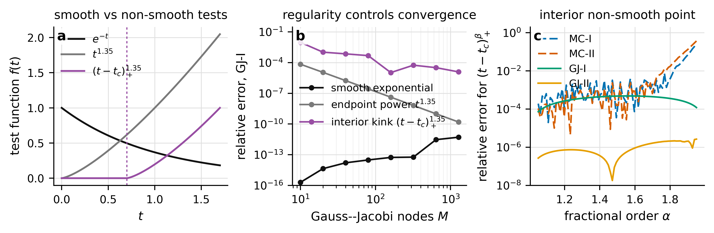
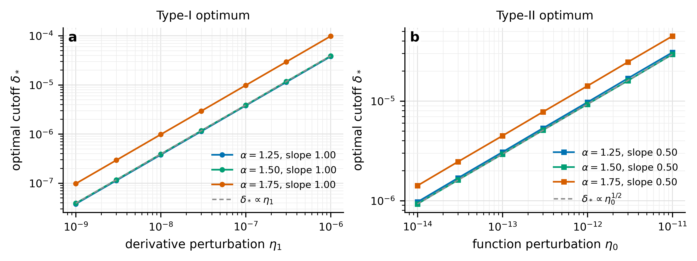
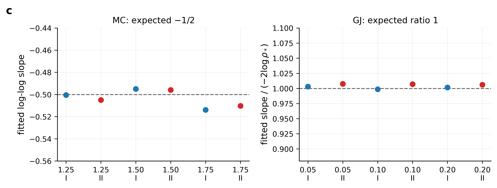

# MCfd 数值验证最终整合包

本包把前面所有实验合并到一个统一目录中，并额外把 **$M$ 的影响** 单独整理为主线之一。所有代码、notebook、Markdown 报告、图片、CSV/JSON 数据和原始参考文件都已放入相应子目录。

## 目录结构

- `code/`: 所有 Python 脚本。
- `notebooks/`: 原始 `MCfd.ipynb` 与重构后的 notebook。
- `reports/`: 分阶段 Markdown 报告与本整合报告。
- `figures/`: 按主题整理的图片，包括 alpha、M effect、precision、trade-off、rate、nonsmooth。
- `data/`: 主要 CSV/JSON 数值结果。
- `packages_unpacked/`: 之前各阶段 package 的解压版，保留 CSV、PDF、PNG、报告和脚本。
- `archived_previous_packages/`: 之前各阶段 zip 包的归档版。
- `reference/`: 原始论文 `main.tex` 和原始参考图。

---

## 1. 实验动机

当前数值验证围绕论文中 Type-I / Type-II 变换后的 Caputo 导数计算公式展开。原始 `MCfd.ipynb` 已经展示了三类现象：

1. $\alpha$ 改变时四种近似 MC-I、MC-II、GJ-I、GJ-II 的误差变化；
2. $M$ 改变时 MC 与 GJ 的误差变化，尤其是 GJ 在大 $M$ 下可能不降反升；
3. 理论中关于光滑性、cutoff trade-off 和收敛率的条件需要用具体例子验证。

最终整合后的验证内容包括：

- $\alpha\to2$ 时 endpoint concentration 的影响；
- $M$ 对 MC 与 GJ 的影响；
- raw quotient 在不同浮点精度 fp64、fp32、fp16、fp8-like 下的差异；
- 非光滑函数下理论假设失效时的表现；
- Remark 3.1 的 cutoff trade-off rates；
- MC 的 $M^{-1/2}$ RMS rate；
- analytic GJ 的 $\rho^{-2M}$ rate。

---

## 2. $\alpha$ 的影响

基准函数沿用原 notebook：

$$
f(t)=e^{-t},\qquad t=1.5.
$$

当 $\alpha\to2$ 时，MC 中的采样变量

$$
\tau\sim \mathrm{Beta}(2-\alpha,1)
$$

会越来越集中在 $\tau=0$ 附近。cutoff 后的小节点样本比例

$$
P(\tau<\epsilon/t)=(\epsilon/t)^{2-\alpha}
$$

随 $\alpha\to2$ 增大，这解释了 MC-I / MC-II 在接近二阶时误差明显变差。


---

## 3. $M$ 的影响：MC 与 GJ 的差异

### 3.1 MC: 误差随 $M$ 下降，但有随机波动

MC-I / MC-II 的误差本质上受 Monte Carlo variance 控制。单次曲线会有波动，所以重构版中对每个 $M$ 做多次重复，并画 median 与 IQR。

|     M |   MC-I median rel. err | MC-I IQR           |   MC-II median rel. err | MC-II IQR          |
|------:|-----------------------:|:-------------------|------------------------:|:-------------------|
|    10 |               0.0267   | [1.4e-02, 4.0e-02] |                0.0135   | [2.6e-03, 1.8e-02] |
|    80 |               0.00719  | [2.8e-03, 1.3e-02] |                0.00349  | [1.8e-03, 5.8e-03] |
|   640 |               0.00186  | [7.1e-04, 3.6e-03] |                0.0014   | [5.9e-04, 2.1e-03] |
| 10240 |               0.000885 | [3.4e-04, 1.4e-03] |                0.000224 | [1.0e-04, 4.5e-04] |

这说明 MC 误差总体随 $M$ 增大下降，但单次 run 可能非单调；论文图中建议用 repeated runs 的 median/IQR，而不是单条随机曲线。

### 3.2 GJ: raw quotient 下 $M$ 越大不一定越好

GJ 的节点靠近 endpoint 的速度很快，最小节点大致满足

$$
\tau_{\min}\sim M^{-2}.
$$

原始 raw quotient 中存在

$$
K_f(t,\tau)=\frac{f'(t)-f'(t-t\tau)}{t\tau},
\qquad
H_f(t,\tau)=\frac{f(t)-f(t-t\tau)-t\tau f'(t)}{(t\tau)^2}.
$$

这两个表达式在连续层面是 removable singularity，但浮点实现中会先做 cancellation，再除以 $\tau$ 或 $\tau^2$。因此 $M$ 变大时，raw quotient 可能先进入 floating-point dominated regime。


GJ raw/stable 诊断表：

|    M |   tau_min |   GJ-I raw |   GJ-II raw |   GJ-I stable |   GJ-II stable |
|-----:|----------:|-----------:|------------:|--------------:|---------------:|
|   10 |  0.00586  |   1.96e-16 |    1.4e-13  |      7.84e-16 |       7.84e-16 |
|   80 |  9.58e-05 |   3.06e-14 |    5.09e-11 |      3.59e-14 |       1.67e-14 |
|  320 |  6.01e-06 |   5.77e-14 |    3.39e-09 |      7.75e-14 |       3.37e-14 |
| 1280 |  3.76e-07 |   5.11e-12 |    8.66e-08 |      5.16e-12 |       2.36e-12 |

可以看到 Type-II raw quotient 对 endpoint cancellation 更敏感。稳定化版本使用 `expm1` 或 Taylor expansion 处理小 $h=t\tau$，可显著区分“理论 quadrature error”和“实现层面的 floating-point error”。

### 3.3 浮点精度与 $M$ 的联合影响


低精度下，尤其是 fp16 和 fp8-like，GJ raw quotient 的误差平台更早出现。该图支持一个实践建议：GJ 的大 $M$ 实验应使用 stable quotient，或者显式处理 $\tau=0$ 的 removable singularity。

---

## 4. raw quotient 的浮点精度诊断


NumPy 没有标准原生 fp8 dtype，因此 fp8-like 部分用 `ml_dtypes.float8_e5m2` 与 `ml_dtypes.float8_e4m3fn` 做逐步量化模拟。结果显示：

- fp64 下 raw quotient 可以维持较长区间；
- fp32 已能观察到 endpoint degradation；
- fp16 和 fp8-like 基本不适合直接计算 Type-II raw quotient；
- Type-II 比 Type-I 更敏感，因为它除以 $(t\tau)^2$。

---

## 5. 非光滑函数的影响

非光滑 benchmark 选为

$$
f(t)=(t-t_c)_+^\beta,\qquad 1<\beta<2.
$$

它是 $C^1$ 但不是 $C^2$，并且有解析 Caputo 导数：

$$
D_C^\alpha (t-t_c)_+^\beta
=
\frac{\Gamma(\beta+1)}{\Gamma(\beta+1-\alpha)}
(t-t_c)_+^{\beta-\alpha}.
$$



结果说明：当 memory interval 内部存在 kink 时，GJ 的高阶或谱收敛不能直接期待；误差通常退化为 algebraic，并可能出现非单调区间。这可以作为论文中“光滑性假设不是装饰性条件”的数值证据。

---

## 6. Remark 3.1 的 cutoff trade-off 验证

Remark 3.1 预测 regularization bias 与 endpoint perturbation amplification 之间存在 trade-off：

Type-I:

$$
E_I(\delta)\approx O(\delta^{2-\alpha})+O(\eta_1\delta^{1-\alpha}).
$$

Type-II:

$$
E_{II}(\delta)\approx
O(\delta^{2-\alpha})+O(\eta_0\delta^{-\alpha})+O(\eta_1\delta^{1-\alpha}).
$$

多 alpha 验证使用

$$
\alpha=1.25,1.50,1.75.
$$


汇总结果：

| $\alpha$ | bias expected | bias measured | $A,C$ expected | $A,C$ measured | $B$ expected | $B$ measured | $\delta_*^I$ | $\delta_*^{II}$ |
|---:|---:|---:|---:|---:|---:|---:|---:|---:|
| 1.25 | 0.75 | 0.75 | -0.25 | -0.25 | -1.25 | -1.25 | 1.00 | 0.50 |
| 1.50 | 0.50 | 0.50 | -0.50 | -0.50 | -1.50 | -1.50 | 1.00 | 0.50 |
| 1.75 | 0.25 | 0.25 | -0.75 | -0.75 | -1.75 | -1.75 | 1.00 | 0.50 |

最优 cutoff scaling 也被验证：

$$
\delta_*^I\propto\eta_1,
\qquad
\delta_*^{II}\propto\eta_0^{1/2}.
$$



---

## 7. MC 的 $M^{-1/2}$ rate 验证

MC 理论 rate 为

$$
\left(\mathbb E|D^\alpha f-D^\alpha_{M,\mathrm{MC}}f|^2\right)^{1/2}
=O(M^{-1/2}).
$$


拟合结果：

| rate | case | expected | fitted |
|---|---:|---:|---:|
| MC $M^{-1/2}$ | $\alpha=1.25$, Type-I | -0.5 | -0.5005 |
| MC $M^{-1/2}$ | $\alpha=1.25$, Type-II | -0.5 | -0.5050 |
| MC $M^{-1/2}$ | $\alpha=1.50$, Type-I | -0.5 | -0.4950 |
| MC $M^{-1/2}$ | $\alpha=1.50$, Type-II | -0.5 | -0.4959 |
| MC $M^{-1/2}$ | $\alpha=1.75$, Type-I | -0.5 | -0.5139 |
| MC $M^{-1/2}$ | $\alpha=1.75$, Type-II | -0.5 | -0.5103 |

结果表明 fractional order 改变的是 variance constant，而不是 Monte Carlo 的 $M^{-1/2}$ rate。

---

## 8. GJ 的 $\rho^{-2M}$ rate 验证

为了验证 analytic GJ rate，使用 rational benchmark

$$
f_a(s)=\frac1{a+s},\qquad t=1.5.
$$

它在

$$
\tau_*=1+\frac a t
$$

处有可控奇点，对应 Bernstein ellipse 参数

$$
\rho_*=x_*+\sqrt{x_*^2-1},\qquad x_*=2\tau_*-1.
$$

理论预测

$$
|D^\alpha f-D^\alpha_{M,\mathrm{GJ}}f|=O(\rho^{-2M}),
$$

即 $\log(error)$ 对 $M$ 的 exponential slope 应接近 $-2\log\rho_*$。


拟合结果：

| $a$ | $\rho_*$ | type | expected slope $-2\log\rho_*$ | fitted exp. slope |
|---:|---:|---|---:|---:|
| 0.05 | 1.438 | Type-I | -0.7263 | -0.7285 |
| 0.05 | 1.438 | Type-II | -0.7263 | -0.7318 |
| 0.10 | 1.667 | Type-I | -1.0217 | -1.0203 |
| 0.10 | 1.667 | Type-II | -1.0217 | -1.0289 |
| 0.20 | 2.044 | Type-I | -1.4299 | -1.4322 |
| 0.20 | 2.044 | Type-II | -1.4299 | -1.4387 |



Type-I rational kernel 有二阶极点，因此会出现 polynomial prefactor；加入 $p\log M$ 后提取出的 exponential slope 仍与理论吻合。

---

## 9. 建议写入论文的结论

可以把数值验证部分组织成以下逻辑：

1. **Alpha sensitivity:** $\alpha\to2$ 时 Beta sampling 向 endpoint 集中，MC cutoff bias 与 variance constant 增强。
2. **M sensitivity:** MC 随 $M$ 增大满足 RMS $M^{-1/2}$；GJ 的理论误差对 analytic kernels 呈 $\rho^{-2M}$，但 raw quotient 在大 $M$ 时会被 endpoint cancellation 污染。
3. **Precision diagnostic:** Type-II raw quotient 对 fp16/fp8-like 不稳定，必须使用 stable quotient 或 endpoint expansion。
4. **Non-smooth benchmark:** 当 $f$ 不满足理论光滑性假设时，GJ 的高阶/谱收敛退化。
5. **Remark 3.1 trade-off:** 三个 $\alpha$ 下均验证了 $\delta^{2-\alpha}$、$\delta^{1-\alpha}$、$\delta^{-\alpha}$ 以及 optimal cutoff scaling。

---

## 10. 主要运行命令

```bash
python code/MCfd_refactored_validation.py --outdir MCfd_refactored_outputs --seed 229 --mc-repeats 24
python code/MCfd_precision_tradeoff_multialpha.py --outdir MCfd_precision_tradeoff_multialpha_report
python code/MCfd_mc_gj_rate_verification.py --outdir MCfd_rate_verification_report --seed 229 --mc-repeats 384
```

生成时间：2026-05-18 06:21:12
