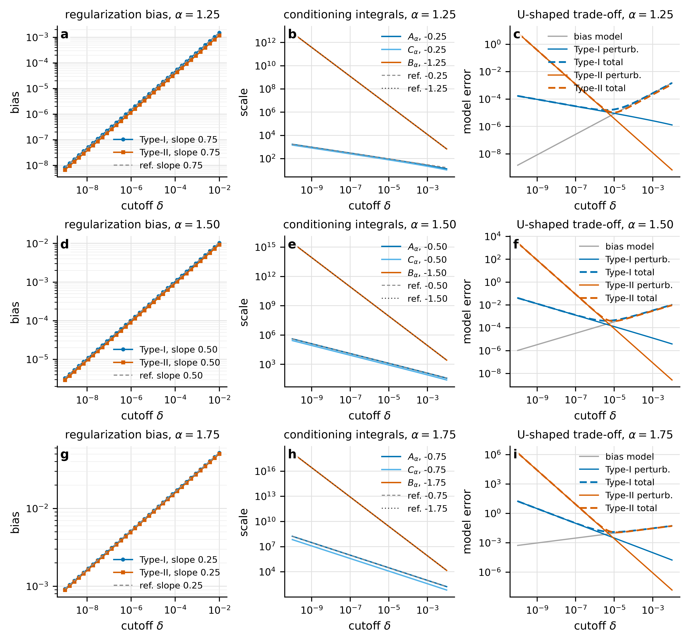

# MCfd 精度诊断与 Remark 3.1 多 alpha trade-off 验证

本文档更新了上一版报告中 Remark 3.1 的 rate 验证。之前只用 $\alpha=1.5$，现在改为三个代表性 case：

$$
\alpha=1.25,\quad 1.50,\quad 1.75.
$$

这样可以覆盖接近一阶、中间阶、接近二阶三种情形。实验仍沿用 `MCfd.ipynb` 的基准函数

$$
f(t)=e^{-t},\qquad t=1.5.
$$

---

## 1. raw quotient 与浮点精度诊断

GJ-I 和 GJ-II 的 integrand 分别含有

$$
K_f(t,\tau)=\frac{f'(t)-f'(t-t\tau)}{t\tau},\qquad
H_f(t,\tau)=\frac{f(t)-f(t-t\tau)-t\tau f'(t)}{(t\tau)^2}.
$$

连续层面二者在 $\tau=0$ 都是 removable singularity；但 raw quotient 在有限精度下会先做近似相等数相减，再除以 $\tau$ 或 $\tau^2$。当 GJ 节点数 $M$ 增大时，最小节点大致满足 $\tau_{\min}\propto M^{-2}$，因此 endpoint cancellation 会被放大。

图中 fp64、fp32、fp16，以及 fp8-like e5m2/e4m3 的对比说明：Type-II raw quotient 对低精度最敏感。fp8-like arithmetic 基本不能直接用于 endpoint raw quotient；fp16 也很容易进入 floating-point dominated regime。

这个实验解释了为什么你原图中 GJ 误差可能随 $M$ 增大反而放大：不是 Gauss--Jacobi 理论本身失效，而是 raw quotient 的实现进入了数值抵消主导区间。

---

## 2. Remark 3.1 的理论 rate

Remark 3.1 的核心 trade-off 是：cutoff $\delta$ 会带来 deterministic consistency bias，但同时抑制 endpoint perturbation amplification。

Type-I:

$$
E_I(\delta)\approx
O(\delta^{2-\alpha})
+
O(\eta_1\delta^{1-\alpha}).
$$

Type-II:

$$
E_{II}(\delta)\approx
O(\delta^{2-\alpha})
+
O(\eta_0\delta^{-\alpha})
+
O(\eta_1\delta^{1-\alpha}).
$$

因此需要验证的斜率是

$$
\text{bias}:\quad 2-\alpha,
\qquad
A_\alpha,C_\alpha:\quad 1-\alpha,
\qquad
B_\alpha:\quad -\alpha.
$$

对于三个 case，理论值分别是：

| $\alpha$ | bias $2-\alpha$ | $A,C$ $1-\alpha$ | $B$ $-\alpha$ |
|---:|---:|---:|---:|
| 1.25 | 0.75 | -0.25 | -1.25 |
| 1.50 | 0.50 | -0.50 | -1.50 |
| 1.75 | 0.25 | -0.75 | -1.75 |

---

## 3. 多 alpha rate 验证结果

每一行对应一个 $\alpha$：1.25、1.50、1.75。三列分别展示：

1. regularization bias 的收敛率；
2. conditioning integrals $A_\alpha(\delta)$、$B_\alpha(\delta)$、$C_\alpha(\delta)$ 的发散率；
3. bias 与 perturbation 叠加后的 U-shaped trade-off。

测得的 log--log slope 如下：

| $\alpha$ | bias exp. | bias I | bias II | $A,C$ exp. | $A$ | $C$ | $B$ exp. | $B$ | $\delta_*^I$ | $\delta_*^{II}$ |
|---:|---:|---:|---:|---:|---:|---:|---:|---:|---:|---:|
| 1.25 | 0.75 | 0.75 | 0.75 | -0.25 | -0.25 | -0.25 | -1.25 | -1.25 | 1.00 | 0.50 |
| 1.50 | 0.50 | 0.50 | 0.50 | -0.50 | -0.50 | -0.50 | -1.50 | -1.50 | 1.00 | 0.50 |
| 1.75 | 0.25 | 0.25 | 0.25 | -0.75 | -0.75 | -0.75 | -1.75 | -1.75 | 1.00 | 0.50 |

可以看到三个 $\alpha$ 下都和 Remark 3.1 的幂律预测一致。尤其是 $\alpha=1.75$ 时，$B_\alpha$ 的斜率接近 $-1.75$，这说明越接近二阶，Type-II 中 function-value perturbation 的 endpoint amplification 越强。

---

## 4. 最优 cutoff scaling 的多 alpha 验证

由 leading terms 平衡可得：

Type-I:

$$
C_b\delta^{2-\alpha}+C_1\eta_1\delta^{1-\alpha}
\quad\Longrightarrow\quad
\delta_*^I\propto \eta_1.
$$

Type-II 在 $\eta_0\delta^{-\alpha}$ 主导时：

$$
C_b\delta^{2-\alpha}+C_0\eta_0\delta^{-\alpha}
\quad\Longrightarrow\quad
\delta_*^{II}\propto \eta_0^{1/2}.
$$

这两个 exponent 理论上都不依赖 $\alpha$。多 alpha 数值验证如下：

三条曲线分别对应 $\alpha=1.25,1.50,1.75$。Type-I 的 measured slope 都接近 1，Type-II 的 measured slope 都接近 0.5。这说明 Remark 3.1 中的 cutoff trade-off 不只是单个 $\alpha=1.5$ 的偶然现象，而是在多个 fractional order 下稳定成立。

---

## 5. 结论与论文写法建议

这组三 case 的验证比单个 $\alpha=1.5$ 更有说服力，可以在论文中表述为：

> We validate the bias--conditioning trade-off in Remark 3.1 for three representative fractional orders, $\alpha=1.25,1.50,1.75$. The measured log--log slopes agree with the predicted rates $2-\alpha$, $1-\alpha$, and $-\alpha$. Moreover, the optimal cutoff obeys $\delta_*^I\propto\eta_1$ and $\delta_*^{II}\propto\eta_0^{1/2}$ across all tested orders.

建议把这部分作为理论验证 subsection 的一张主图。图中可以强调：

- regularization bias 随 $\delta\to0$ 收敛，rate 是 $2-\alpha$；
- conditioning terms 随 $\delta\to0$ 发散，rate 是 $1-\alpha$ 或 $-\alpha$；
- $\alpha$ 越接近 2，允许的稳定 cutoff 窗口越窄；
- Type-II 的 $B_\alpha(\delta)$ 项最强，因此 raw quotient 和低精度实现都更危险。

---

## 6. 文件说明

- `fig04_precision_raw_quotients.pdf/png`: raw quotient 的 precision diagnostic；
- `fig05_precision_GJ_M_sweep.pdf/png`: precision-dependent GJ $M$ sweep；
- `fig06_remark31_multialpha_delta_tradeoff_rates.pdf/png`: 三个 $\alpha$ 的 rate 验证主图；
- `fig07_remark31_multialpha_optimal_delta_scaling.pdf/png`: 三个 $\alpha$ 的最优 cutoff scaling；
- `remark31_multialpha_rate_summary.csv`: slope 汇总表；
- `remark31_multialpha_regularization_bias.csv`: bias 数据；
- `remark31_multialpha_conditioning_integrals.csv`: conditioning integral 数据；
- `remark31_multialpha_optimal_delta.csv`: optimal cutoff 数据。
