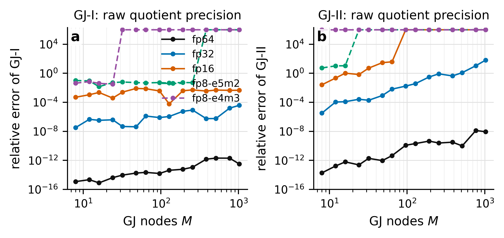
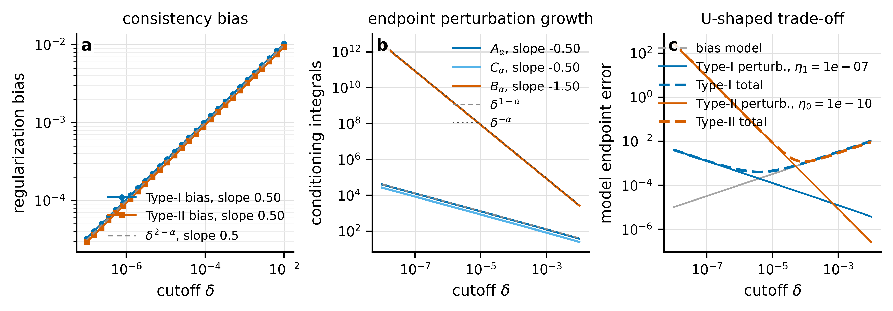
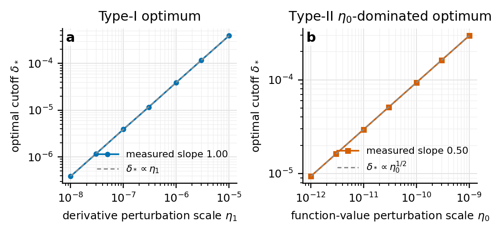

# MCfd 精度诊断与 Remark 3.1 trade-off 验证

本文档基于你上传的 `MCfd.ipynb`，在原有 MC-I、MC-II、GJ-I、GJ-II 公式上补充两个验证实验：

1. 通过改变 raw quotient 的有效浮点精度，观察 GJ-I/GJ-II 中 removable singularity 在数值实现里的放大效应；
2. 验证论文 Remark 3.1 的 bias--conditioning trade-off，包括 cutoff $\delta$ 的幂律收敛/发散率和最优 cutoff scaling。

基准函数沿用原 notebook 的设定：

$$
f(t)=e^{-t},\qquad t=1.5,\qquad \alpha=1.5.
$$

说明：NumPy 没有标准原生 FP8 dtype。这里的 FP8 使用 `ml_dtypes.float8_e5m2` 和 `ml_dtypes.float8_e4m3fn` 做逐步量化模拟；GJ 节点、权重与最终求和保留 fp64，因此图中主要隔离的是 raw quotient 计算本身的精度敏感性。

---

## 1. 动机：raw quotient 为什么会随 $M$ 放大误差

GJ-I 和 GJ-II 的 integrand 分别包含

$$
K_f(t,\tau)=\frac{f'(t)-f'(t-t\tau)}{t\tau},
$$

以及

$$
H_f(t,\tau)=\frac{f(t)-f(t-t\tau)-t\tau f'(t)}{(t\tau)^2}.
$$

连续意义下，二者在 $\tau=0$ 都是 removable 的；但 raw quotient 会先做近似相等数的相减，再除以 $\tau$ 或 $\tau^2$。GJ 节点的最小值满足近似关系

$$
\tau_{\min}\sim M^{-2},
$$

因此 $M$ 增大时，endpoint cancellation 会被放大。Type-II 最敏感，因为它除以 $(t\tau)^2$。

图 (a) 显示 Type-II raw quotient $H_f$ 的相对误差随 $\tau_j$ 逼近 0 急剧上升。fp32 在很小节点处已经明显劣化，fp16 更早失效；fp8-like arithmetic 基本不能直接用于 endpoint raw quotient。图 (b) 是 Type-I raw quotient $K_f$，同样存在放大，但比 Type-II 温和。图 (c) 把局部 quotient 误差传导到 GJ-II 的整体分数阶导数近似，说明你原图里观察到的 “$M$ 增大但 GJ 误差放大” 可以由 raw quotient 的有限精度病态解释。

结论：GJ 不是简单地 “$M$ 越大越好”。如果直接使用 raw quotient，增大 $M$ 会把节点推向 0，从而进入 floating-point dominated regime。实际实现里建议对 endpoint quotient 使用 `expm1`、Taylor branch 或 cutoff regularization。

---

## 2. Remark 3.1 的 trade-off 公式

Remark 3.1 的核心是：cutoff $\delta$ 不是数学变换的一部分，而是数值稳定化参数。它带来两个方向相反的影响。

Type-I:

$$
\text{endpoint error}
\approx
O(\delta^{2-\alpha})+O(\eta_1\delta^{1-\alpha}).
$$

Type-II:

$$
\text{endpoint error}
\approx
O(\delta^{2-\alpha})+O(\eta_0\delta^{-\alpha})+O(\eta_1\delta^{1-\alpha}).
$$

在本实验中 $\alpha=1.5$，理论斜率应为

$$
2-\alpha=0.5,\qquad 1-\alpha=-0.5,\qquad -\alpha=-1.5.
$$

测得的 log--log 斜率如下：

| quantity | expected slope | measured slope |
|---|---:|---:|
| Type-I regularization bias | 0.50 | 0.50 |
| Type-II regularization bias | 0.50 | 0.50 |
| $A_\alpha(\delta)$ | -0.50 | -0.50 |
| $C_\alpha(\delta)$ | -0.50 | -0.50 |
| $B_\alpha(\delta)$ | -1.50 | -1.50 |

这些结果与 Remark 3.1 的幂律预测一致：regularization bias 按 $O(\delta^{2-\alpha})$ 收敛；endpoint perturbation/conditioning 项则在 $\delta\to0$ 时按 $O(\delta^{1-\alpha})$ 或 $O(\delta^{-\alpha})$ 发散。

---

## 3. 最优 cutoff 的 scaling

进一步平衡 leading terms 可以得到最优 cutoff 的 scaling。Type-I 中

$$
E_I(\delta)\approx C_b\delta^{2-\alpha}+C_1\eta_1\delta^{1-\alpha},
$$

因此

$$
\delta_*^I\propto \eta_1.
$$

Type-II 在 $\eta_0\delta^{-\alpha}$ 主导时

$$
E_{II}(\delta)\approx C_b\delta^{2-\alpha}+C_0\eta_0\delta^{-\alpha},
$$

因此

$$
\delta_*^{II}\propto \eta_0^{1/2}.
$$

| optimum relation | expected slope | measured slope |
|---|---:|---:|
| Type-I $\delta_*$ vs $\eta_1$ | 1.00 | 1.00 |
| Type-II $\delta_*$ vs $\eta_0$ | 0.50 | 0.50 |

这说明 Remark 3.1 的 trade-off 不只是定性解释，也能通过实际例子验证其 convergence/divergence rate。

---

## 4. 对论文写法的建议

可以在理论验证部分加入如下叙述：

> Although the transformed kernels possess removable endpoint singularities at the representation level, their raw difference-quotient evaluation is not finite-precision stable near $\tau=0$. The cutoff $\delta$ introduces a deterministic bias of order $O(\delta^{2-\alpha})$, while suppressing perturbation amplification of order $O(\eta_1\delta^{1-\alpha})$ for Type-I and $O(\eta_0\delta^{-\alpha})+O(\eta_1\delta^{1-\alpha})$ for Type-II. The numerical slopes observed in the validation experiment agree with these rates, confirming the bias--conditioning trade-off in Remark 3.1.

实现建议：

- GJ-II 尽量避免在很小节点上直接计算 raw quotient；
- 对指数函数类 benchmark 可使用 `expm1`，一般函数可使用 Taylor endpoint branch；
- MC-II 中的 $\delta=\epsilon/t$ 应按精度和噪声水平调节，低精度需要更大的 cutoff；
- fp8/fp16 不应直接用于 Type-II raw quotient，除非先做 endpoint-stabilized reformulation。

---

## 5. 文件说明

- `fig04_precision_raw_quotients.pdf/png`: raw quotient 在 fp8/fp16/fp32/fp64 下的精度诊断；
- `fig05_precision_GJ_M_sweep.pdf/png`: GJ-I/GJ-II 的 precision-dependent $M$ sweep；
- `fig06_remark31_delta_tradeoff_rates.pdf/png`: Remark 3.1 的幂律 rate 验证；
- `fig07_remark31_optimal_delta_scaling.pdf/png`: 最优 cutoff 的 scaling 验证；
- `precision_GJ_M_errors.csv`, `precision_raw_quotient_node_errors.csv`: 精度实验数据；
- `remark31_*.csv`: trade-off 验证数据。
