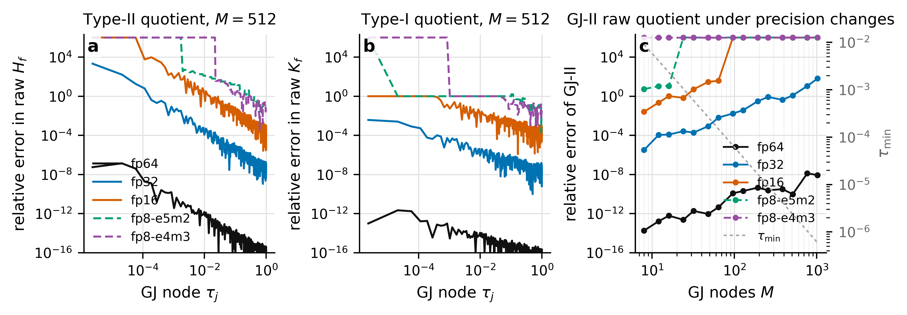
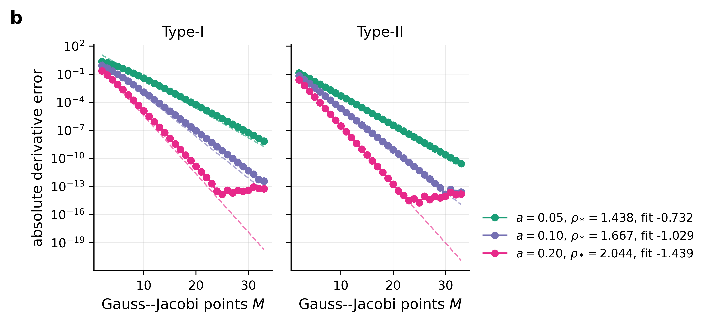

# Theoretical Analysis

This directory contains derivative-level numerical validation for the theory
section of the tDWfPINNs paper. These scripts do not train PINNs. They test the
transformed Caputo derivative estimators directly so that quadrature,
regularization, and finite-precision effects are not mixed with neural-network
optimization error.

Install the repository requirements from the project root before running the
validation scripts:

```bash
python -m pip install -r requirements.txt
```

## Paper Mapping

| Paper part | What is checked | Code and figures |
| --- | --- | --- |
| Theorem `thm:represent_2`, direct and transformed representations | Type-I and Type-II are equivalent to the Caputo derivative for `alpha in (1, 2)`. | `MCfd_integrated_final_package/code/MCfd_refactored_validation.py` |
| Theorem `thm:stability`, representation-level stability | Type-I and Type-II share the same `C^2` stability constant in exact arithmetic. | alpha and M diagnostics in `MCfd_integrated_final_package/figures/` |
| Corollary `coro:4`, Type-I/II numerical schemes | MC-I, MC-II, GJ-I, and GJ-II are evaluated on the same derivative benchmarks. | `fig01_alpha_sweep_exp.png`, `fig02_M_sweep_exp_diagnostic.png` |
| Proposition `prop:mc-convergence` | Monte Carlo RMS derivative error follows `O(M^-1/2)`. | `figures/rate/fig09_mc_sqrtM_rate.png` |
| Propositions `prop:delta-conditioning` and `prop:regularization-bias` | Cutoff conditioning terms scale like `delta^(1-alpha)` and `delta^(-alpha)`, while regularization bias scales like `delta^(2-alpha)`. | `figures/tradeoff/fig06_remark31_multialpha_delta_tradeoff_rates.png` |
| Remark `rem:delta-tradeoff` | The cutoff is a numerical stabilization parameter, not part of the exact operator. | trade-off figures and CSV summaries |
| Theorem `thm:GJ-convergence` | GJ has `O(M^-r)` finite-smoothness behavior and `O(rho^(-2M))` analytic-kernel behavior. | `figures/rate/fig10_gj_rho_spectral_rate.png`, `gj_mr_rate_validation/` |
| Proposition `prop:complexity` | Type-II avoids the `O(NM)` shifted automatic-differentiation evaluations required by Type-I. | paper timing/memory discussion |
| finite-precision remark near `alpha -> 2` | Raw endpoint quotient errors are implementation artifacts caused by cancellation near `tau=0`. | `alpha2_precision_remark/` |

The most important formulas checked numerically are:

```text
MC RMS error:          O(M^-1/2)
GJ finite smoothness:  |I_alpha[phi] - Q_M^GJ[phi]| <= C M^-r ||phi||_{C^r}
GJ analytic kernels:   O(rho^(-2M))
MC endpoint mass:      P(xi < delta) = delta^(2-alpha)
Type-I cutoff error:   O(delta^(2-alpha)) + O(eta_1 delta^(1-alpha))
Type-II cutoff error:  O(delta^(2-alpha)) + O(eta_0 delta^(-alpha)) + O(eta_1 delta^(1-alpha))
```

## Packages

| Path | Purpose |
| --- | --- |
| [`MCfd_integrated_final_package/`](MCfd_integrated_final_package/README.md) | Main integrated validation package for alpha sweeps, M sweeps, nonsmooth tests, precision diagnostics, cutoff trade-off checks, and MC/GJ rate validation. |
| `alpha2_precision_remark/` | Focused finite-precision diagnostic for raw GJ endpoint quotients as `alpha -> 2`. |
| `gj_mr_rate_validation/` | Additional GJ finite-smoothness `M^-r` validation. |

## Focused Commands

From the repository root:

```bash
python theoretical_analysis/alpha2_precision_remark/code/MCfd_alpha2_precision_diagnostic.py --outdir theoretical_analysis/alpha2_precision_remark
python theoretical_analysis/gj_mr_rate_validation/MCfd_gj_Mr_rate_validation.py --outdir theoretical_analysis/gj_mr_rate_validation/MCfd_GJ_Mr_rate_outputs --alpha 1.5
```

The integrated package commands are listed in
[`MCfd_integrated_final_package/README.md`](MCfd_integrated_final_package/README.md).

## Figures






