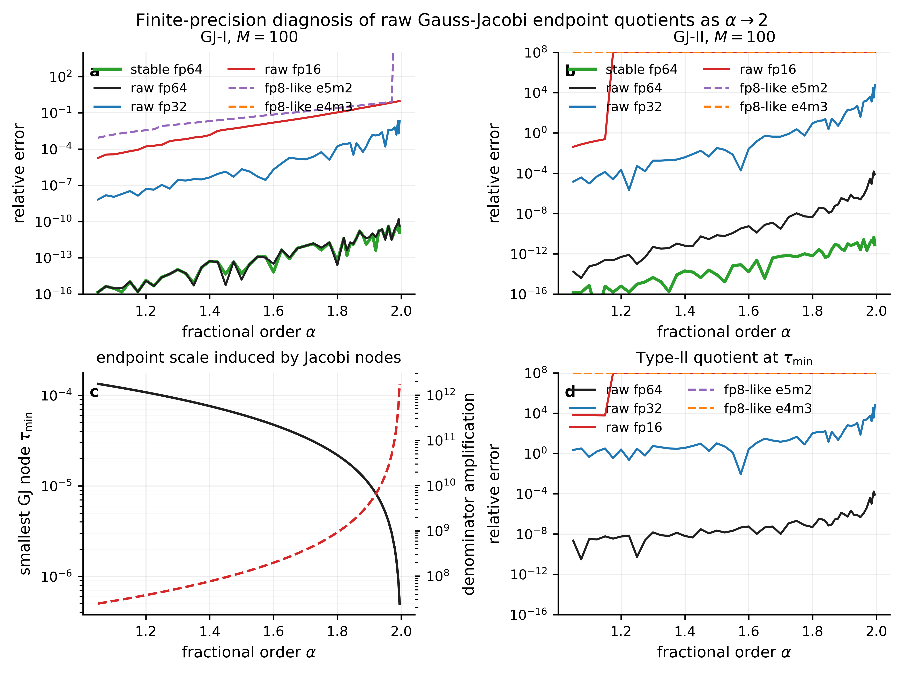
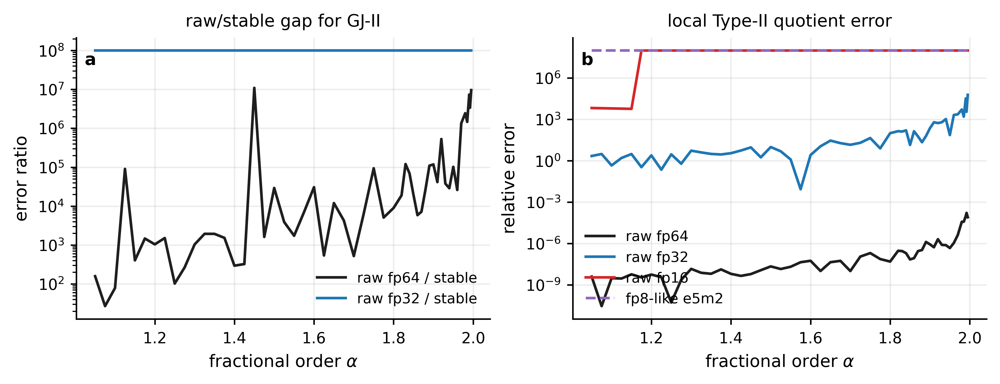

# Alpha-to-two finite-precision diagnostic for GJ raw quotients

## Motivation

The validation figures show that the Gauss-Jacobi (GJ) error can increase slowly as the fractional order approaches the second-order limit \(\alpha\to2\).  This script tests whether the increase is a quadrature effect or a finite-precision effect caused by raw evaluation of endpoint-removable quotients.

The test uses the same smooth benchmark as `MCfd.ipynb`,

\[
f(t)=e^{-t},\qquad t=1.5,
\]

and compares raw GJ-I/GJ-II quotient evaluation under fp64, fp32, fp16 and fp8-like quantized arithmetic.  NumPy has no standard native fp8 dtype; the fp8 curves use `ml_dtypes.float8_e5m2` and `ml_dtypes.float8_e4m3fn` as controlled quantization diagnostics.

## Stable quotient used as reference

For the exponential benchmark, the raw Type-I quotient in the notebook can be rewritten as

\[
\frac{f'(t)-f'(t-h)}{(x+1)t}
= e^{-t}\frac{\operatorname{expm1}(h)}{(x+1)t},
\qquad h=\frac{t(x+1)}2.
\]

The Type-II quotient satisfies

\[
\frac{f(t)-f(t-h)-h f'(t)}{h^2}
= -e^{-t}\frac{\operatorname{expm1}(h)-h}{h^2},
\]

with the Taylor limit \(-e^{-t}/2\) used for very small \(h\).  These stable forms evaluate the same continuous kernels, but avoid subtracting nearly equal numbers.

## Main figures

## Numerical summary

The following table reports relative GJ-II derivative errors at selected values of \(\alpha\), with \(M=100\).  The last two columns isolate the local Type-II quotient error at the smallest GJ node.

| alpha | tau_min | (t tau_min)^-2 | stable GJ-II | raw fp64 | raw fp32 | raw fp16 | fp8-like e5m2 | q2 local fp64 | q2 local fp32 |
|---:|---:|---:|---:|---:|---:|---:|---:|---:|---:|
| 1.250 | 9.99e-05 | 4.46e+07 | 9.61e-16 | 9.87e-14 | 5.30e-04 | overflow/NaN | overflow/NaN | 5.28e-11 | 2.93 |
| 1.500 | 6.14e-05 | 1.18e+08 | 8.43e-15 | 6.89e-11 | 0.0321 | overflow/NaN | overflow/NaN | 2.19e-08 | 9.98 |
| 1.750 | 2.79e-05 | 5.69e+08 | 5.01e-13 | 1.05e-08 | 2.33 | overflow/NaN | overflow/NaN | 2.03e-07 | 44.9 |
| 1.900 | 1.05e-05 | 4.05e+09 | 2.16e-12 | 2.56e-07 | 68.1 | overflow/NaN | overflow/NaN | 8.70e-07 | 232 |
| 1.950 | 5.12e-06 | 1.69e+10 | 2.50e-12 | 2.53e-07 | 39.6 | overflow/NaN | overflow/NaN | 4.71e-07 | 73.8 |
| 1.980 | 2.02e-06 | 1.09e+11 | 1.20e-11 | 2.93e-05 | 4.08e+03 | overflow/NaN | overflow/NaN | 3.77e-05 | 5.25e+03 |
| 1.990 | 1.00e-06 | 4.40e+11 | 1.19e-11 | 8.75e-05 | 2.96e+04 | overflow/NaN | overflow/NaN | 9.93e-05 | 3.36e+04 |

## Interpretation

The experiment supports the hypothesis that the observed increase of GJ error as \(\alpha\to2\) is primarily a finite-precision endpoint-cancellation effect of the raw quotient realization.

First, the stable fp64 curve stays close to the quadrature/roundoff floor over the same alpha range where the raw fp64 GJ-II error grows by several orders of magnitude.  Second, fp32 deteriorates much earlier, and fp16/fp8-like arithmetic often overflows or produces invalid values because the denominator \((t\tau)^2\) becomes too small after quantization.  Third, the local quotient error at \(\tau_{\min}\) grows consistently with the global GJ-II error.

This should not be described as a failure of Gauss-Jacobi quadrature.  The mathematical integrand has a removable endpoint value.  The issue is that the raw algebraic formula evaluates a numerator of size \(O(h^2)\) by subtracting \(O(1)\) quantities and then divides by \(h^2\).  As \(\alpha\to2\), the Jacobi parameter \(1-\alpha\to-1\), and the left endpoint nodes become increasingly close to \(\tau=0\), which exposes the removable singularity to finite-precision cancellation.

## Suggested paper-level conclusion

The proper statement is therefore:

> The increase of raw GJ errors near \(\alpha=2\) is an implementation-level finite-precision effect.  Stable endpoint quotients or Taylor endpoint replacement recover the expected high-accuracy behavior for smooth benchmarks.

This conclusion is compatible with the theoretical GJ convergence results, which assume exact arithmetic evaluation of smooth transformed kernels.
