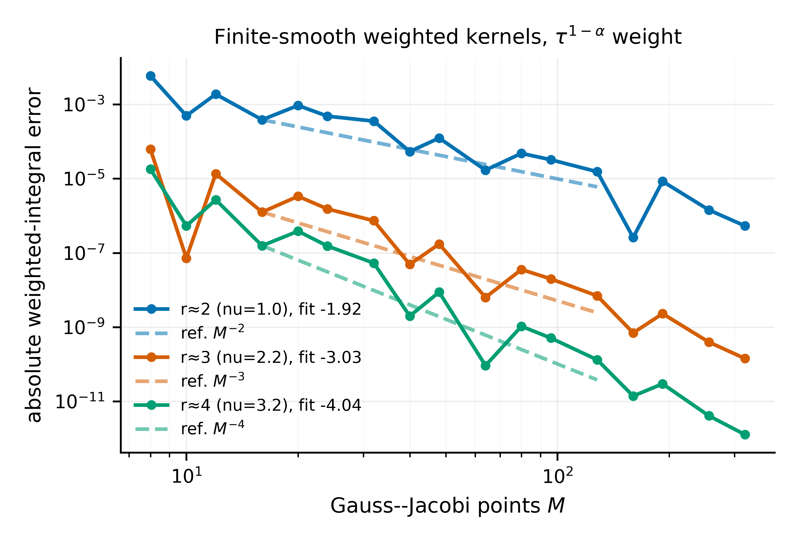
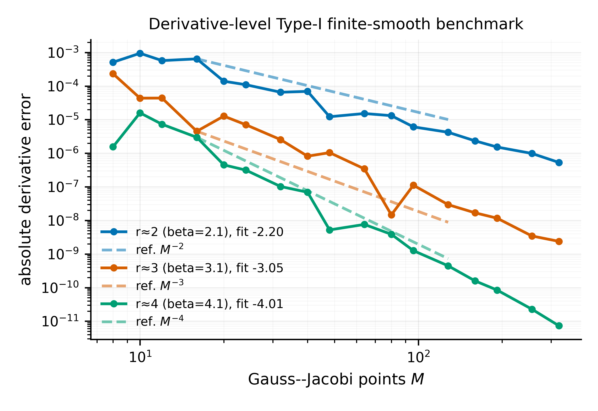

# Gauss--Jacobi finite-smoothness rate check: $M^{-r}$
This report adds the algebraic finite-smoothness rate check requested for the Gauss--Jacobi error analysis. It complements the previously tested analytic rate $
ho^{-2M}$.
## Why this experiment is needed
The analytic rate $
ho^{-2M}$ is only appropriate when the transformed kernel is analytic in a Bernstein ellipse. The more general theorem in the paper is the finite-smoothness statement
$$
|I_lpha[\phi]-Q_M^{\mathrm{GJ}}[\phi]|\le C_{lpha,r}M^{-r}\|\phi\|_{C^r([0,1])}.
$$
Therefore the numerical validation should include a non-analytic, finitely smooth case. Otherwise the validation would overemphasize analytic kernels.
## Numerical design
We use two tests.
1. **Abstract weighted-kernel test.** We directly test the weighted Gauss--Jacobi quadrature functional
$$
I_lpha[\phi]=\int_0^1 	au^{1-lpha}\phi(	au)\,d	au.
$$
The kernels contain an interior algebraic kink, so the convergence is algebraic rather than spectral.
2. **Derivative-level Type-I test.** We use
$$
f(s)=(s-t_c)_+^eta,
$$
which induces an interior finite-smoothness defect in the transformed Type-I kernel. The exact Caputo derivative is available in closed form,
$$
\partial_t^lpha (t-t_c)_+^eta
=rac{\Gamma(eta+1)}{\Gamma(eta+1-lpha)}(t-t_c)_+^{eta-lpha}.
$$
All tests use $lpha=1.5$ and fit log--log slopes over $M=16,\ldots,128$ before the floating-point floor dominates.
## Fitted slopes
| experiment               |   alpha | label          |   target_rate |   fitted_slope |     r2 |   fit_min |   fit_max |
|:-------------------------|--------:|:---------------|--------------:|---------------:|-------:|----------:|----------:|
| abstract weighted kernel |     1.5 | r≈2 (nu=1.0)   |             2 |         -1.918 | 0.8145 |        16 |       128 |
| abstract weighted kernel |     1.5 | r≈3 (nu=2.2)   |             3 |         -3.032 | 0.8269 |        16 |       128 |
| abstract weighted kernel |     1.5 | r≈4 (nu=3.2)   |             4 |         -4.043 | 0.8359 |        16 |       128 |
| derivative-level Type-I  |     1.5 | r≈2 (beta=2.1) |             2 |         -2.195 | 0.9225 |        16 |       128 |
| derivative-level Type-I  |     1.5 | r≈3 (beta=3.1) |             3 |         -3.051 | 0.8503 |        16 |       128 |
| derivative-level Type-I  |     1.5 | r≈4 (beta=4.1) |             4 |         -4.007 | 0.9618 |        16 |       128 |
## Figures

## Interpretation
The fitted slopes are algebraic and close to the reference $M^{-r}$ guide lines. This is the numerical behavior expected from the finite-smoothness Gauss--Jacobi theorem. The result also explains why the previous $
ho^{-2M}$ experiment should be presented only as the analytic special case, not as the main general GJ estimate.
A careful paper statement should therefore be:
> For finitely smooth transformed kernels, the Gauss--Jacobi error decays algebraically as $O(M^{-r})$. If the kernels are analytic, this improves to the spectral rate $O(
ho^{-2M})$.
