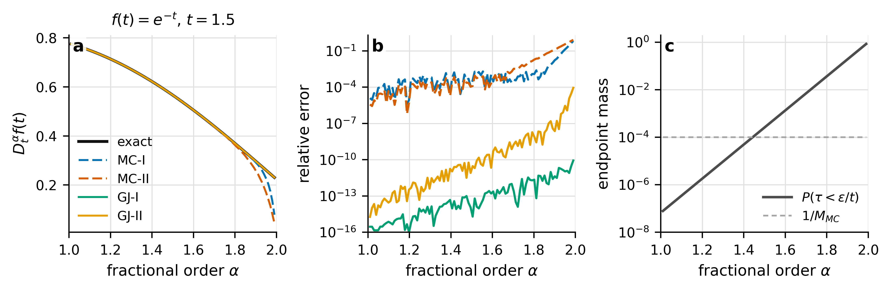
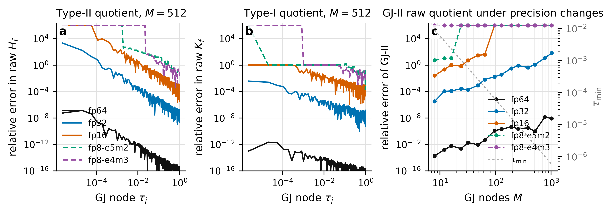
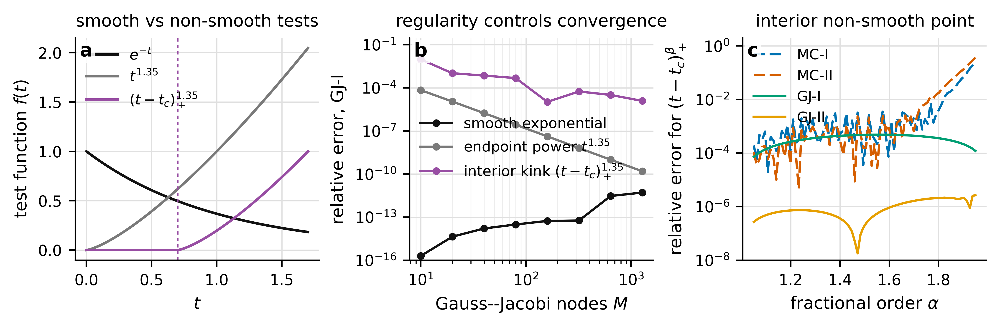

# Revised Section 3.2: Derivative-level validation and implementation diagnostics

This preview is a readable Markdown version of the proposed LaTeX replacement in `section_3_2_revised.tex`. It is designed to solve the reviewer concerns by separating quadrature theory, implementation diagnostics, and empirical rate evidence.

## 1. Motivation and protocol

The revised section no longer says that experiments “validate the theorems.” The theorems are proved analytically. The numerical role of Section 3.2 is instead to isolate four implementation-level effects:

1. Monte Carlo sampling error;
2. Gauss-Jacobi quadrature error;
3. denominator cutoff bias and conditioning;
4. finite-precision cancellation in raw endpoint quotients.

The default benchmark is

\[
f(t)=e^{-t},\qquad t=1.5,
\]

with exact Caputo derivative

\[
\partial_t^\alpha f(t)=t^{2-\alpha}E_{1,3-\alpha}(-t).
\]

The key clarification is the distinction between raw and stable quotients. With \(h=t\tau\),

\[
K_f(t,\tau)=\frac{f'(t)-f'(t-h)}{h},\qquad
H_f(t,\tau)=\frac{f(t)-f(t-h)-h f'(t)}{h^2}.
\]

For \(f(t)=e^{-t}\), the stabilized forms are

\[
K_f^{\rm stab}=e^{-t}\frac{\operatorname{expm1}(h)}{h},
\qquad
H_f^{\rm stab}=e^{-t}\frac{h-\operatorname{expm1}(h)}{h^2}.
\]

This makes explicit that the continuous removable singularity is not automatically stable under raw floating-point subtraction.

## 2. Alpha sensitivity

The endpoint mass is

\[
\mathbb P(\tau<\varepsilon/t)=(\varepsilon/t)^{2-\alpha},
\qquad \tau\sim \mathrm{Beta}(2-\alpha,1).
\]

Thus, as \(\alpha\to2\), Monte Carlo samples increasingly fall into the endpoint region where raw quotients and cutoffs are most sensitive. The revised text explicitly says that this is an endpoint-conditioning issue of the practical estimator, not a breakdown of the theoretical \(M^{-1/2}\) Monte Carlo rate.

## 3. Quadrature size \(M\): stochastic error versus endpoint cancellation

Representative numerical values:

| \(M\) | MC-I median | MC-II median | \(\tau_{\min}\) | GJ-II raw | GJ-II stable |
|---:|---:|---:|---:|---:|---:|
| 10 | \(2.67\times10^{-2}\) | \(1.35\times10^{-2}\) | \(5.86\times10^{-3}\) | \(1.40\times10^{-13}\) | \(7.84\times10^{-16}\) |
| 80 | \(7.19\times10^{-3}\) | \(3.49\times10^{-3}\) | \(9.58\times10^{-5}\) | \(5.09\times10^{-11}\) | \(1.67\times10^{-14}\) |
| 320 | \(4.07\times10^{-3}\) | \(1.43\times10^{-3}\) | \(6.01\times10^{-6}\) | \(3.39\times10^{-9}\) | \(3.37\times10^{-14}\) |
| 1280 | \(1.85\times10^{-3}\) | \(1.01\times10^{-3}\) | \(3.76\times10^{-7}\) | \(8.66\times10^{-8}\) | \(2.36\times10^{-12}\) |
| 10240 | \(8.85\times10^{-4}\) | \(2.24\times10^{-4}\) | -- | -- | -- |

The reviewer-sensitive interpretation is now precise: Gauss-Jacobi quadrature is not deteriorating. The raw endpoint quotient realization is entering a roundoff-dominated regime because \(\tau_{\min}=O(M^{-2})\).

## 4. Finite precision

The revised text explicitly says that fp8 is only a controlled e5m2/e4m3-like quantization diagnostic, not native NumPy arithmetic and not full mixed-precision PINN training. This avoids overclaiming.

## 5. Remark 3.1 trade-off

The wording is changed from “validation” to “asymptotic numerical check.” This directly addresses the reviewer concern that Figure 4 partly visualizes leading theoretical components.

| \(\alpha\) | bias exp. | measured | \(A,C\) exp. | \(A\) | \(C\) | \(B\) exp. | \(B\) | \(\delta_*^I\) | \(\delta_*^{II}\) |
|---:|---:|---:|---:|---:|---:|---:|---:|---:|---:|
| 1.25 | 0.75 | 0.75 | -0.25 | -0.25 | -0.25 | -1.25 | -1.25 | 1.00 | 0.50 |
| 1.50 | 0.50 | 0.50 | -0.50 | -0.50 | -0.50 | -1.50 | -1.50 | 1.00 | 0.50 |
| 1.75 | 0.25 | 0.25 | -0.75 | -0.75 | -0.75 | -1.75 | -1.75 | 1.00 | 0.50 |

The revised explanation states that \(\delta_*^I\propto\eta_1\) and \(\delta_*^{II}\propto\eta_0^{1/2}\) are obtained from the leading bias-conditioning model, not from full training errors.

## 6. MC and GJ rates

| Test | case | type | expected slope | fitted slope |
|---|---|---|---:|---:|
| MC | \(\alpha=1.25\) | Type-I | -0.50 | -0.5005 |
| MC | \(\alpha=1.25\) | Type-II | -0.50 | -0.5050 |
| MC | \(\alpha=1.50\) | Type-I | -0.50 | -0.4950 |
| MC | \(\alpha=1.50\) | Type-II | -0.50 | -0.4959 |
| MC | \(\alpha=1.75\) | Type-I | -0.50 | -0.5139 |
| MC | \(\alpha=1.75\) | Type-II | -0.50 | -0.5103 |
| GJ | \(a=0.05,\rho_*=1.438\) | Type-I | -0.7263 | -0.7285 |
| GJ | \(a=0.05,\rho_*=1.438\) | Type-II | -0.7263 | -0.7318 |
| GJ | \(a=0.10,\rho_*=1.667\) | Type-I | -1.0217 | -1.0203 |
| GJ | \(a=0.10,\rho_*=1.667\) | Type-II | -1.0217 | -1.0289 |
| GJ | \(a=0.20,\rho_*=2.044\) | Type-I | -1.4299 | -1.4322 |
| GJ | \(a=0.20,\rho_*=2.044\) | Type-II | -1.4299 | -1.4387 |

The revised GJ explanation states that the sharp slope \(-2\log\rho_*\) comes from the nearest singularity and that fitting is restricted to the pre-saturation spectral regime. This avoids claiming more than Theorem 3.3 directly states.

## 7. Nonsmooth benchmark

The revised text fixes the typo \(f<C^2\) to \(f\notin C^2\), gives the exact benchmark parameters, and explains that an interior kink at \(t_c\) maps to

\[
\tau_c=1-\frac{t_c}{t}.
\]

Thus the loss of spectral convergence is tied directly to the loss of smoothness of \(K_f\) and \(H_f\) on the memory interval.

## 8. Bridge to Section 4

The final paragraph explicitly explains why Section 4 uses moderate Gauss-Jacobi sizes and Monte Carlo cutoffs. This connects the derivative-level diagnostics to the PINN training experiments.
